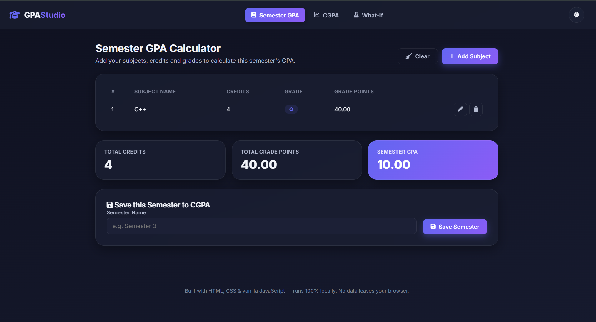
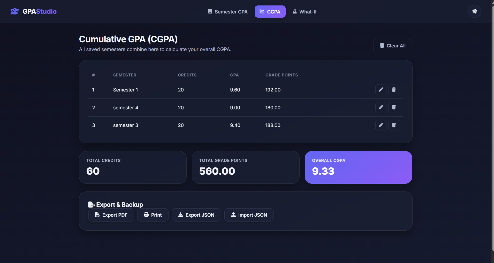
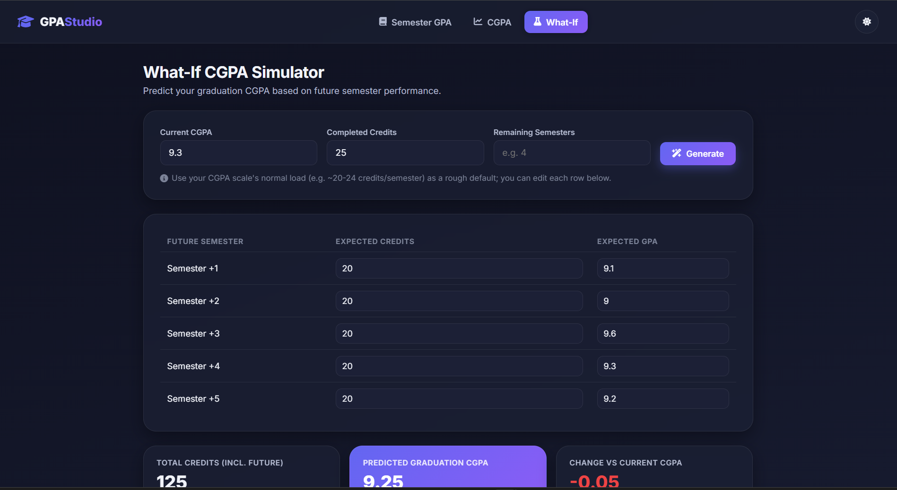

# 🎓 GPA / CGPA Calculator — Student Dashboard


-6366f1)


A clean, modern, fully offline **GPA and CGPA calculator** with a **What-If graduation CGPA simulator** — built with nothing but **HTML5, CSS3, and vanilla JavaScript (ES6+)**. No frameworks, no backend, no database. Just open `index.html` and go.

---

## 🎥 Demo Video
[Watch the demo](https://youtu.be/vpI8JaGC3JQ)


## 🔗 Live Demo
[Try it here](https://chilakalavyshnavi.github.io/GPA-CGPA-Calculator/)

## 📖 Overview

GPA Studio helps students:

- Calculate their **semester GPA** by adding subjects, credits, and grades
- Track **multiple semesters** and calculate an overall **CGPA**
- Run **"What-If" simulations** to predict their graduation CGPA based on future semester performance
- Export results as **PDF**, **print** them, or back them up as **JSON**

Everything is calculated locally in the browser and persisted with `localStorage` — your academic data never leaves your machine.

---

## ✨ Features

### Semester GPA Calculator
- Add, edit, and delete unlimited subjects
- Enter subject name, credits, and grade (`O, A+, A, B+, B, C, P, F`)
- Grade points are centrally configurable in one constant (`js/validation.js`)
- Full input validation (empty names, invalid credits, invalid grades)
- Live-calculated Total Credits, Total Grade Points, and GPA

### CGPA Tracker
- Save any calculated semester into a running CGPA
- Edit or delete saved semesters
- Live-calculated overall Total Credits, Total Grade Points, and CGPA

### What-If CGPA Simulator
- Enter current CGPA, completed credits, and remaining semesters
- Auto-generates editable rows for each future semester
- Live updates predicted graduation CGPA as you tweak expected GPAs/credits
- Shows the **change vs your current CGPA** (colored green/red)

### Extra Features
- 🌗 Dark mode (toggle button or `Ctrl/Cmd + D`)
- 💾 LocalStorage persistence — refresh-safe
- 📄 Export to PDF (via jsPDF, CDN)
- 🖨️ Print-friendly report view
- 📦 Export / Import full JSON backup
- 🔔 Toast notifications for every action
- ⚠️ Confirmation dialogs for destructive actions
- ⏳ Loading animation on startup
- 📱 Fully responsive, mobile-friendly layout with a slide-out nav drawer
- ⌨️ Keyboard shortcuts (`Esc` to cancel an edit or close a dialog)
- 🧊 Glassmorphism-inspired card design with smooth animations

---

## 🖼️ Screenshots

### Semester GPA Calculator


### CGPA Tracker


### What-If Simulator


## 🚀 Installation

No build step, no `npm install`. Just clone and open.

```bash
git clone https://github.com/chilakalavyshnavi/GPA-CGPA-Calculator.git
cd GPA-CGPA-Calculator
```

Then either:

- Double-click `index.html` to open it directly in your browser, **or**
- Use the **Live Server** extension in VS Code for auto-reload during development (see below).

---

## 🧭 Usage

1. Go to the **Semester GPA** tab and click **Add Subject**.
2. Fill in the subject name, credits, and grade, then confirm with the ✔ button.
3. Repeat for all subjects — your GPA updates live.
4. Name the semester and click **Save Semester** to send it to your CGPA tracker.
5. Switch to the **CGPA** tab to see your overall CGPA across all saved semesters.
6. Switch to the **What-If** tab to simulate future semesters and predict your graduation CGPA.
7. Use **Export PDF**, **Print**, or **Export JSON** to save your results.

---

## 📁 Folder Structure

```text
GPA-CGPA-Calculator/
│
├── index.html
├── README.md
├── LICENSE
├── .gitignore
│
├── css/
│   ├── style.css          # Core layout, theme variables, components
│   ├── responsive.css      # Breakpoints for tablet/mobile
│   └── animations.css      # Keyframes & transitions
│
├── js/
│   ├── app.js               # Entry point — wires everything together
│   ├── calculator.js        # GPA/CGPA state + pure calculation logic
│   ├── simulator.js         # What-If prediction logic
│   ├── storage.js           # localStorage wrapper
│   ├── ui.js                 # DOM rendering, toasts, dialogs, tabs
│   ├── validation.js        # Input validation + grade-point constants
│   └── export.js            # PDF / Print / JSON import-export
│
├── assets/
│   ├── icons/
│   └── images/
│
└── docs/
    └── screenshots/
```

---

## 🛠️ Technologies Used

- **HTML5** — semantic markup
- **CSS3** — custom properties, Flexbox, Grid, glassmorphism, animations
- **Vanilla JavaScript (ES6+)** — modules split by responsibility, no framework
- **Font Awesome** (CDN) — icons
- **jsPDF** (CDN) — client-side PDF generation
- **Google Fonts (Inter)** — typography

---

## 🔭 Future Improvements

- [ ] Support additional grading scales (4.0, percentage) via a settings panel
- [ ] Add charts (GPA trend across semesters) using a lightweight charting library
- [ ] Add unit tests for `calculator.js` and `simulator.js`
- [ ] PWA support (installable, offline-first with a service worker)
- [ ] Multi-language support (i18n)
- [ ] Cloud sync (optional, opt-in) for cross-device access

---

## 🧪 Testing

See the full [manual test checklist](#-manual-test-cases) below before each release.

---

## 📄 License

This project is licensed under the [MIT License](LICENSE).


---

## 👤 Author

**Vyshnavi Chilakala**
GitHub: [chilakalavyshnavi](https://github.com/chilakalavyshnavi)

---

## 📋 Manual Test Cases

### Semester GPA
- [ ] Add a subject with valid name, credits, and grade → row appears, GPA updates
- [ ] Try adding a subject with an empty name → validation error shown, row not saved
- [ ] Try adding a subject with credits = 0 or negative → validation error shown
- [ ] Try adding a subject with credits > 30 → validation error shown
- [ ] Try saving without selecting a grade → validation error shown
- [ ] Edit an existing subject → values update correctly, GPA recalculates
- [ ] Delete a subject → confirmation dialog appears; confirming removes the row
- [ ] Clear semester with subjects present → confirmation dialog, all rows removed
- [ ] Clear semester with no subjects → toast saying nothing to clear, no dialog
- [ ] Save a semester with 0 subjects → validation error, semester not saved
- [ ] Save a semester with an empty name → validation error shown
- [ ] Refresh the page → subjects persist (localStorage)

### CGPA
- [ ] Save two or more semesters → CGPA recalculates correctly (credit-weighted average)
- [ ] Edit a saved semester's GPA/credits → CGPA recalculates
- [ ] Delete a semester → confirmation dialog, CGPA recalculates
- [ ] Clear all semesters → confirmation dialog, table empties
- [ ] Refresh the page → semesters persist

### What-If Simulator
- [ ] Enter current CGPA, completed credits, remaining semesters → rows generate
- [ ] Edit a future semester's GPA → predicted CGPA updates live
- [ ] Edit a future semester's credits → predicted CGPA updates live
- [ ] Enter an invalid GPA (e.g. 11 or -1) → validation error shown, no crash
- [ ] Improvement stat turns green when predicted CGPA > current, red when lower

### Export / Backup
- [ ] Export PDF → file downloads and opens with correct semester data
- [ ] Print → browser print dialog opens with a clean, nav-free layout
- [ ] Export JSON → file downloads with subjects, semesters, and simulator state
- [ ] Import JSON → previously exported backup restores all data correctly
- [ ] Import an invalid/corrupted JSON file → error toast shown, no crash

### General
- [ ] Dark mode toggle switches theme and persists across refresh
- [ ] `Ctrl/Cmd + D` toggles dark mode
- [ ] `Esc` cancels an in-progress edit or closes the confirm dialog
- [ ] Mobile menu (hamburger) opens/closes and navigates correctly
- [ ] All three tabs are reachable and render correctly on mobile widths

### Edge Cases
- [ ] Decimal credits (e.g. 3.5) calculate correctly
- [ ] Very large number of subjects/semesters (20+) renders without lag
- [ ] localStorage disabled/unavailable (e.g. private mode) → app still functions in-memory, no crash

---

## 🌐 Browser Compatibility Checklist

| Browser | Status |
|---|---|
| Chrome (latest) | ✅ Fully supported |
| Firefox (latest) | ✅ Fully supported |
| Edge (latest) | ✅ Fully supported |
| Safari (latest) | ✅ Fully supported |
| Mobile Safari (iOS) | ✅ Fully supported |
| Chrome for Android | ✅ Fully supported |
| Internet Explorer 11 | ❌ Not supported (uses modern CSS/ES6+) |
